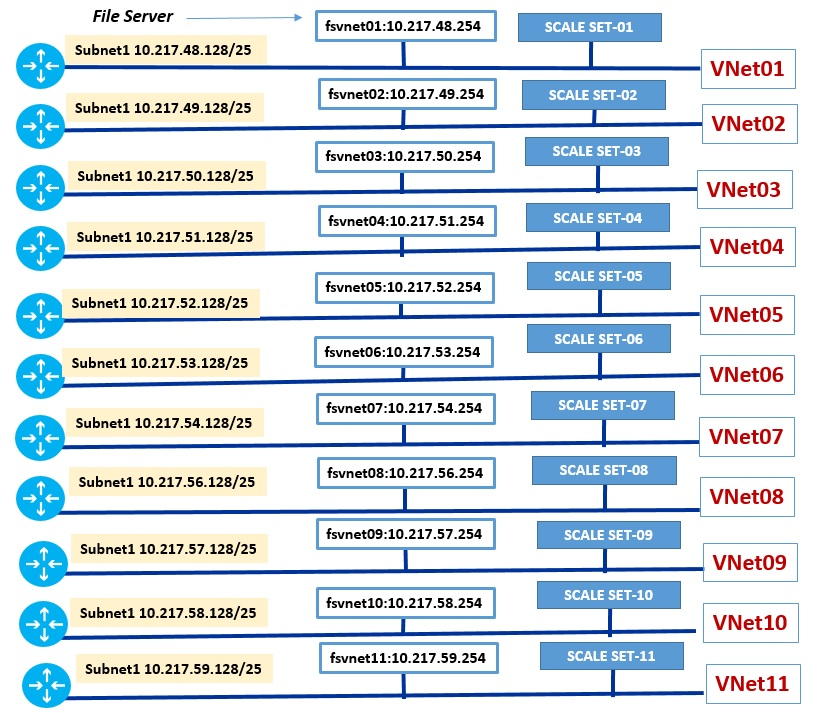

# ARM templates to deploy Datasynaspe Engines in Azure VMs.
#### The templates use Azure Scale Set to make the deployment and increase/shrink the number of Azure VMs, in hybrid architecture with Datasynaspe directors/brokers on-premises. The Datasynapse clients, directors, brokers communicate with Azure Datasynapse Engine in Azure through ExpressRoute private peering connection.

#### Assumptions:
###### - Datasynapse Engines run in Windows 2008R2
###### - The Azure VMs spin up through Azure Scale Set, using the Windows 2008R2 in Azure image gallery
###### - architecture run in hybrid model with Datasynapse clients, Directors and Brokers on-premises and only Datasynaspe Engines in Azure IaaS VMs
###### - intercommunication between Datasynapse Engines in Azure VMs and the rest of components on-premises pass through the ExpressRoute connection
###### - the customer edge routers inject in ExpressRoute private BGP peering the default route (0.0.0.0/0), causing some restriction in reachability of Azure public Services (i.e. Azure storage accounts) and failure of agent in VM extension.  

## List of scripts
| script name             |  description                                                                                    |
--------------------------|-----------------|
| 00_DeploAll.ps1         | powershell script to create File Servers and Scale Set deployments.  the script call 02_DeployFS_args.ps1 and 03_DeployVMSS_args.ps1 with different input parameters |
| 00_ScaleAllExisting.ps1 | powershell script to scale up/down the pre-existing Scale Set deployments. Run this script ONLY if the Scale Set already exists |
| 02_DeployFS.ps1 | basic powershell script to run the azureFSdeploy.json. the script create a single file server attached to a VNet |
| 02_DeployFS_args.ps1 | powershell script to create a file share with input arguments |
| 03_DeployVMSS.ps1 | powershell to create a single Scale Set |
| 03_DeployVMSS_args.ps1 | powershell to create a Scale Set with input arguments |
| 04_ScaleExisting.ps1 | scale up/down the number of VMs a single pre-existing Scale Set |
| 04_ScaleExisting_args.ps1 | scale up/down the number of VMs in a single pre-existing Scale Set, with input arguments |
| azureFSdeploy.json | ARM template to deploy the File Server in a specific VNet |
| azureFSdeploy.parameters.json | ARM input parameter file; it feeds parameters in azureFSdeploy.json |
| azureVMSSdeploy.json | ARM template to deploy the Scale set with input arguments. |
| azureVMSSdeploy.parameters.json | ARM input file for azureVMSSdeploy.json |
| VNets.ps1 | create #11 VNets. The example use the specific IP Address schema but you can change it based on your needs |


## Description
- The architecture use an ExpressRoute private peering to establish a private high throughput network interconnection between on-premises and Azure.
- The core of ARM template **azureVMSSdeploy.json** uses a Windows unattended installation to install the Datasynapse Engine software package; the unattended installation doesn't requires any ARM VM extension and it works also in the case the network administrator decide to inject in BGP a default route (0.0.0.0/0) that determine a force tunneling and missing communication with script stored in Azure Storage account.
The full process of installation of single Datasynapse Engine is executed in three phases:
 - [x] PHASE 1: create the File Server by ARM
 - [x] PHASE 2: manual copy the Datasynapse Engine network installation package in shared folder of the file Server VMs attached to the VNets
 - [x] PHASE 3: run the Scale Set ARM templates. VMs in Scale Set are deployed through Azure image gallery using the latest image of Windows 2008 R2–SP1. After the bootstrap phase, the script makes an unattended installation in 4 actions:
  a) by robocopy.exe transfer the Datasynapse installation package from the shared folder of the file server to the local disk (C:). The log of robocopy operation is stored on ephemeral SSD disk D:
  b) copy the file hosts in C:\\Windows\\System32\\drivers\\etc
  c) Set the Windows firewall in the Azure VM to OFF
  d) Run the command setup.exe to install Datasynapse Engine in the VM

The most interesting part of the Scale Set template is the Windows **unattended** installation; here the relevant fragment:
```xml
"[Concat('<FirstLogonCommands xmlns:wcm=\"http://schemas.microsoft.com/WMIConfig/2002/State\" >
<SynchronousCommand wcm:action=\"add\">
   <CommandLine>
   cmd.exe /c robocopy \\\\', variables('fileServerIPAddress'),
              '\\shared C:\\install /MIR /V > D:\\unattendCopyFiles.log
   </CommandLine>
   <Description>Copy files</Description>
   <Order>1</Order></SynchronousCommand>
<SynchronousCommand wcm:action=\"add\">
   <CommandLine>
   cmd.exe /c robocopy C:\\install C:\\Windows\\System32\\drivers\\etc hosts /IS > D:\\unattendedCopyhostsFile.log
   </CommandLine>
   <Description>Copy files</Description>
   <Order>2</Order></SynchronousCommand>
<SynchronousCommand wcm:action=\"add\">
   <CommandLine>
   cmd.exe /c netsh advfirewall set allprofiles state off > D:\\unattendedDisableFirewall.log
   </CommandLine>
   <Description>disable the Windows firewall</Description>
   <Order>3</Order></SynchronousCommand>
<SynchronousCommand wcm:action=\"add\">
   <CommandLine>
   cmd.exe /c C:\\install\\setup.exe -s -f2c:\\datasynapse.log
   </CommandLine>
   <Description>install Datasynapse Engine</Description>
   <Order>4</Order></SynchronousCommand>
</FirstLogonCommands>')]"
```
In Scale set template:
- **"overprovision"** set to **"true"**
- **"upgradePolicy"** set to **"Manual"** - this avoids automatic update and unexpected reboot during the running jobs


  

## Caveats
1. all the scripts and templates work with pre-existing #11 VNets: VNet01, VNet02, VNet03,...., VNet10, VNet11
2. After creation of file server the package of Datasynapse Engine needs to be copied manually in shared folder **\\\127.0.0.1\\shared**
   There is margin to improve the process by creation of Sysprep image containing the file servers with Datasynapse network installation package in the shared folder. This avoid the manual operation copy of Datasynapse software package in every file server.
3. the ARM scripts solve the routing issues related to the presence of force tunneling (injection of default route 0.0.0.0/0) in ExpressRoute private peering. Anyway to keep the VMs setup simple is recommended to avoid injection of default route in BGP private peering.
