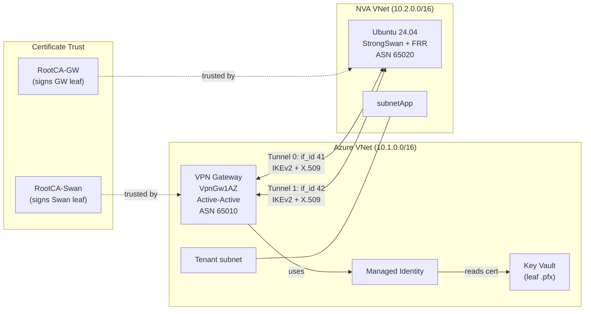

# Building Azure-to-StrongSwan Site-to-Site VPN with X.509 Digital Certificates

This repository builds a reproducible lab for an active-active, route-based Site-to-Site VPN between Azure VPN Gateway and a StrongSwan NVA on Ubuntu 24.04 with digital certificate authentication.

Implementation highlights:

- VPN connections use IKEv2 X.509 certificate authentication (no PSK)
- Leaf certificate stored in Key Vault, consumed by the gateway via a user-assigned managed identity
- StrongSwan-side variables auto-generated from `init.json` + live Azure values (script 02b)
- StrongSwan installs its certificates and runs XFRM route-based tunnels with BGP (FRR)
- Custom IPsec/IKE policy (GCMAES256 + DHGroup14 + PFS2048)
- NSG rules configured for NVA forwarded traffic (inbound + outbound AllowRFC1918)
- Test VMs with nginx installed via Custom Script Extension

## Architecture



## Repository Layout

```
init.json                            Deployment and topology parameters
XFRM.md                              Linux XFRM framework and IPsec packet flow internals
certs/                               Generated certificates (gitignored)
scripts-ps/                          PowerShell deployment scripts
├── 01-create-certs.sh               Generates root/leaf certificates and PFX (bash)
├── 02-deploy-azure.ps1              Provisions all Azure infrastructure (12 steps)
├── 02b-generate-strongswan-vars.ps1 Auto-populates variables in script 03
├── 03-configure-strongswan.ps1      Configures NVA remotely (Invoke-AzVMRunCommand)
├── configure-strongswan-nva.sh      Generated bash config script (for manual runs)
├── 04-deploy-vms.ps1                Deploys test VMs + nginx + UDR
└── 05-cleanup.ps1                   Deletes the resource group
config/swanctl.conf                  Reference swanctl template (auto-generated by script 03)
```

### Deployment Sequence

```
01-create-certs.sh            (bash — run in Azure Cloud Shell or WSL or Linux VM)
        │
        ▼
02-deploy-azure.ps1           (PowerShell — creates all Azure infra)
        │
        ▼
02b-generate-strongswan-vars.ps1  (PowerShell — patches vars in script 03)
        │
        ▼
03-configure-strongswan.ps1   (PowerShell — configures NVA via RunCommand)
        │
        ▼
04-deploy-vms.ps1             (PowerShell — optional, test VMs + nginx)
        │
        ▼
05-cleanup.ps1                (PowerShell — deletes resource group)
```

## Prerequisites

- **PowerShell 7.0+** with Az modules:
  ```powershell
  Install-Module Az -Scope CurrentUser
  ```
- Authenticated session: `Connect-AzAccount`
- **bash** environment for certificate generation (Azure Cloud Shell, WSL, or Linux)
- `openssl` and `jq` (for script 01)
- Azure subscription permissions for:
  - Resource groups, networking, VPN gateways
  - Managed identities and role assignments
  - Key Vault (RBAC-enabled certificate import)

## Quick Start

### 1) Configure parameters

Update at least these values in `init.json`:

- `subscriptionName`
- `adminPassword`
- `certPassword`
- address spaces if you need custom topology

> **Security:** `init.json` contains plaintext credentials (`adminPassword`,
> `certPassword`). Do **not** commit this file to a shared or public repository.
> The `.gitignore` does not exclude it by default — add it manually if pushing
> to a remote, or use environment variables to override sensitive values.

### 2) Generate certificates

Run from `scripts-ps/` in <ins>Azure Cloud Shell</ins>, <ins>WSL</ins>, or <ins>Linux</ins>:

```bash
bash 01-create-certs.sh
```

Artifacts are written to the folder `certs/`. If running in Cloud Shell, download the folder:

```bash
# zip all the certificates created
zip -r ~/certs.zip certs/

#dowload locally the zip file
download ~/certs.zip
```

### 3) Deploy Azure resources

Run from `scripts-ps/`:

```powershell
./02-deploy-azure.ps1
```

This script creates (12 steps):

1. Resource Group
2. VNet1 (Azure side) with GatewaySubnet + tenant subnet
3. VNet2 (NVA side) with nvaSubnet + subnetApp
4. User-Assigned Managed Identity for VPN Gateway Key Vault access
5. Key Vault (RBAC mode) with soft-delete purge handling
6. RBAC role assignments (Secrets User, Certificate User, Certificates Officer)
7. Import VPN Gateway leaf .pfx into Key Vault
8. Public IPs for VPN Gateway (2x zone-redundant, Standard SKU)
9. VPN Gateway (active-active, VpnGw1AZ, Generation2) with managed identity
10. NVA VM (Ubuntu 24.04) with NSG (IKE/NAT-T/SSH + AllowRFC1918 inbound/outbound) and IP forwarding
11. Local Network Gateways (2x) pointing to NVA public IP + BGP addresses
12. VPN Connections (2x) with custom IPsec/IKE policy (GCMAES256) and certificate authentication

Uses `New-AzVirtualNetworkGatewayCertificateAuthentication` — no ARM template workaround needed.

**Duration:** ~30–45 minutes (VPN Gateway provisioning dominates).

### 3b) Generate the StrongSwan variable block

After the gateway and NVA exist (wait for script 02 to complete — VPN Gateway
provisioning takes ~30–45 min), auto-populate the variables at the top of script 03:

```powershell
./02b-generate-strongswan-vars.ps1
```

A timestamped backup of `03-configure-strongswan.ps1` is created before editing.

### 4) Configure StrongSwan on the NVA VM

```powershell
./03-configure-strongswan.ps1
```

The script performs three steps:

1. **Generates** `configure-strongswan-nva.sh` locally (all variables baked in)
2. **Uploads certificates** to the NVA via `Invoke-AzVMRunCommand` (base64-encoded, no SSH/password needed)
3. **Executes** the configuration script on the NVA via `Invoke-AzVMRunCommand` (saves it as `~/configure-strongswan-nva.sh` with chmod +x, then runs it)

No SSH or SCP is required — everything goes through the Azure management plane.
If you decline steps 2 or 3, the script prints manual commands and exits cleanly.

The generated bash script configures:

- Package installation (strongswan, strongswan-swanctl, libcharon-extra-plugins, frr)
- Persistent sysctl (IP forwarding, rp_filter=0 on all/default/eth0, disable redirects)
- strongSwan charon (`install_routes = no`)
- `swanctl.conf` with two IKEv2 connections (gw0, gw1) using X.509 certs + GCMAES256
- XFRM interfaces (ipsec0 if_id=41, ipsec1 if_id=42) via a systemd oneshot service
- FRR BGP peering with both VPN Gateway instances
- Boot ordering: `network-online → vpn-xfrm → ipsec → frr`

#### Manual fallback (if script 03 is interrupted or you prefer SSH)

If the script is interrupted after Step 1, or you decline the automated steps,
you can complete the configuration manually via SSH:

```bash
# 1. Copy certificates to the NVA
scp certs/swan-cert.cer certs/swan-cert.key certs/VPNRootCA-GW.cer certs/VPNRootCA-Swan.cer `
    <adminUsername>@<NVA_PUBLIC_IP>:~/certs/

# 2. Copy the generated configuration script
scp scripts-ps/configure-strongswan-nva.sh <adminUsername>@<NVA_PUBLIC_IP>:~/

# 3. SSH into the NVA and run the script
ssh <adminUsername>@<NVA_PUBLIC_IP>
mkdir -p ~/certs    # if not already created by scp
sudo bash ~/configure-strongswan-nva.sh
```

Replace `<adminUsername>` and `<NVA_PUBLIC_IP>` with the values from `init.json`
and `02-deploy-azure.ps1` output (or check the variable block at the top of
`03-configure-strongswan.ps1`).

### 5) Deploy test VMs (optional)

```powershell
.\04-deploy-vms.ps1
```

Creates two Ubuntu 24.04 VMs for end-to-end tunnel validation:

- **vm1** in VNet1/tenant subnet (Azure VPN Gateway side)
- **vm2** in VNet2/subnetApp (NVA side)
- Shared NSG: SSH + ICMP + HTTP inbound from 10.0.0.0/8, outbound AllowRFC1918
- Route table on subnetApp: VNet1 address space → NVA private IP
- **nginx** installed via Azure Custom Script Extension on both VMs
- **NRMS NSG fixup** (Step 6): waits for corporate NRMS subnet-level NSGs to be
  applied by Azure Policy (polls up to 10 min), then adds `AllowRFC1918-In/Out`
  rules to allow forwarded/tunnel traffic

### 6) Verify

On NVA:

```bash
sudo swanctl --list-sas          # IKE + CHILD SAs established
ip link show ipsec0              # XFRM interfaces up
ip link show ipsec1
sudo vtysh -c 'show bgp summary'  # BGP neighbors Established
sudo vtysh -c 'show ip bgp'       # Learned + advertised prefixes
```

From PowerShell:

```powershell
$rgName = (Get-Content ../init.json | ConvertFrom-Json).rgName
Get-AzVirtualNetworkGatewayConnection -ResourceGroupName $rgName -Name conn-gw1-0 |
    Select-Object Name, ConnectionStatus, IngressBytesTransferred, EgressBytesTransferred
```

If test VMs are deployed:

```bash
# From vm1: ping + curl vm2 across the tunnel
ping -c 4 10.2.1.4
curl http://10.2.1.4

# From vm2: ping + curl vm1 across the tunnel
ping -c 4 10.1.1.4
curl http://10.1.1.4
```

### 7) Cleanup

```powershell
.\05-cleanup.ps1
```

Prompts for confirmation, then deletes the entire resource group.

## Cryptography and Policy

Configured policy values:

- IKE encryption: GCMAES256
- IKE integrity/PRF: SHA256
- DH group: DHGroup14
- IPsec encryption: GCMAES256
- IPsec integrity: GCMAES256 (AEAD)
- PFS group: PFS2048
- SA lifetime: 3600 seconds

StrongSwan proposals in script/template:

- proposals = aes256gcm16-prfsha256-modp2048
- esp_proposals = aes256gcm16-modp2048

## Implementation Notes

Details worth knowing when reading or extending the scripts:

1. The PowerShell scripts use `New-AzVirtualNetworkGatewayCertificateAuthentication`
   to create certificate-authenticated connections natively — no ARM template
   workaround needed (unlike the bash/az CLI variant in `scripts/`).
2. `03-configure-strongswan.ps1` uses a split here-string approach: `@"..."@`
   (expandable) for the variable header to bake PowerShell values into bash
   variables, and `@'...'@` (verbatim) for the body so bash `$variable`
   references pass through literally. Using `\$` does NOT escape `$` in
   PowerShell (backtick does).
3. `inboundAuthCertificateSubjectName` is the bare CN `swan-cert` (no `CN=`
   prefix). StrongSwan presents the full DN `CN=swan-cert` as its local IKE id;
   Azure validates that against the bare subject.
4. The outbound Key Vault URL must be the certificate identifier
   (`.../certificates/<name>/<version>`), not the secret identifier.

## NSG Considerations for NVA Forwarded Traffic

> **Quick Reference:**
> - Default `AllowVnetOutBound` requires BOTH source AND destination in `VirtualNetwork` service tag
> - Forwarded packets with source IPs outside the VNet's address space (e.g., from IPsec tunnel) do NOT match `VirtualNetwork` on the source side
> - `AllowInternetOutBound` doesn't help either — the destination is VnetLocal, not Internet
> - Result: `DenyAllOutBound` drops the forwarded packet silently
> - Fix: Add explicit outbound AllowRFC1918 rules (10.0.0.0/8 → 10.0.0.0/8) on BOTH NIC-level and subnet-level NSGs
> - Same issue on inbound: subnet/NIC NSG `AllowVnetInBound` won't match forwarded traffic with foreign source IPs
> - NRMS (Microsoft corporate) NSGs auto-applied at subnet level add another layer to check
> - IP Flow Verify only tests with the VM's own IPs — can't simulate forwarded source IPs, so it may falsely report "Allow"

When an NVA forwards packets with source IPs from outside the VNet (e.g.,
10.1.1.10 from VNet1 arriving via IPsec tunnel), Azure NSG default rules
**block the traffic**:

- **Outbound on NVA**: `AllowVnetOutBound` requires both source AND destination
  in the `VirtualNetwork` service tag. A forwarded source IP (10.1.1.10) is NOT
  in VNet2's tag, so it falls through to `DenyAllOutBound`.
- **Inbound on destination**: `AllowVnetInBound` similarly fails for non-VNet
  source IPs (unless a UDR for that prefix exists on the destination subnet,
  which adds it to the VirtualNetwork tag).

**Required NSG rules:**

| NSG | Rule | Direction | Source | Destination |
|-----|------|-----------|--------|-------------|
| NVA NIC NSG | AllowRFC1918 | Inbound | 10.0.0.0/8 | 10.0.0.0/8 |
| NVA NIC NSG | AllowRFC1918-Out | Outbound | 10.0.0.0/8 | 10.0.0.0/8 |
| Test VM NSG | AllowRFC1918-Out | Outbound | 10.0.0.0/8 | 10.0.0.0/8 |

If Microsoft corporate NRMS NSGs are auto-applied at the subnet level, they
also need `AllowRFC1918` (inbound) and `AllowRFC1918-Out` (outbound) rules.
Script `04-deploy-vms.ps1` Step 6 handles this automatically — it polls for
NRMS NSGs to appear (up to 10 minutes) and patches them with RFC1918 rules.

> **Note**: Azure IP Flow Verify (`Test-AzNetworkWatcherIPFlow`) tests with the
> VM's own IPs and cannot simulate forwarded source IPs — it may falsely report
> "Allow" when forwarded traffic is actually blocked.

## Debug Commands (NVA)

StrongSwan / IPsec state:

    sudo swanctl --list-conns        # loaded connection definitions (gw0/gw1 + children)
    sudo swanctl --list-sas          # active IKE + CHILD SAs (empty = no tunnel up)
    sudo swanctl --list-certs        # certs loaded from /etc/swanctl/x509, x509ca
    sudo swanctl --stats             # is charon responding / uptime
    sudo swanctl --load-all          # reload config after editing swanctl.conf
    sudo swanctl --initiate --ike gw0 --child s2s0   # manually bring up tunnel 0
    sudo swanctl --initiate --ike gw1 --child s2s1   # manually bring up tunnel 1
    sudo swanctl --terminate --ike gw0               # tear down tunnel 0

StrongSwan service + logs (Ubuntu 24.04 logs to syslog under the `charon` tag,
NOT the `ipsec` unit journal):

    systemctl status ipsec strongswan-starter --no-pager
    systemctl is-active ipsec strongswan-starter
    sudo journalctl -t charon -n 80 --no-pager       # last 80 charon log lines
    sudo journalctl -t charon -f                     # live follow during initiate
    sudo grep -Ei 'charon|IKE_SA|CHILD_SA' /var/log/syslog | tail -n 80
    # filter the negotiation phases only:
    sudo journalctl -t charon --no-pager | \
      grep -Ei 'IKE_SA|CHILD_SA|auth|cert|proposal|established|retransmit|NO_PROPOSAL|TS_UNACCEPTABLE|peer config'

XFRM interfaces and routing:

    ip link show ipsec0 ; ip link show ipsec1
    ip route
    ip route show table 220                 # strongSwan policy routes (throw routes)
    ip route get 20.49.215.95               # GW PIP must go via NVA_GW, NOT the tunnel
    ip xfrm state                           # installed IPsec SAs (after tunnel up)
    ip xfrm policy
    systemctl status vpn-xfrm.service --no-pager

Sysctl (forwarding / rp_filter):

    sysctl net.ipv4.ip_forward
    sysctl net.ipv4.conf.all.rp_filter
    sysctl net.ipv4.conf.eth0.rp_filter   # must be 0 (strict mode drops XFRM packets)

BGP / FRR:

    sudo vtysh -c 'show bgp summary'        # neighbors 10.1.0.5 / 10.1.0.4 -> Established
    sudo vtysh -c 'show ip bgp'             # learned + advertised prefixes
    sudo vtysh -c 'show ip route bgp'
    sudo vtysh -c 'show running-config'
    systemctl status frr --no-pager

End-to-end connectivity (after SAs are INSTALLED and BGP is Established):

    ip route | grep -E '10\.1|ipsec'        # Azure prefixes installed via ipsec0/ipsec1
    ping -c 4 10.1.1.4                       # ping an Azure VNet host across the tunnel
    sudo swanctl --list-sas | grep -E 'bytes|packets'   # confirm counters incrementing

The deployment does NOT create test hosts by default (the tenant subnet is
empty). To get two pingable endpoints with nginx across the tunnel, run
`scripts-ps/04-deploy-vms.ps1` from the deployment host. It creates:

- **vm1** in VNet1/tenant subnet and **vm2** in VNet2/subnetApp
- A route table on subnetApp steering VNet1's address space to the NVA
- nginx installed via Custom Script Extension
- NSG with SSH, ICMP, HTTP inbound + outbound AllowRFC1918

Then test with ping and curl between the two VM private IPs printed by the script.

## Debug Commands (Azure — PowerShell)

```powershell
$rgName = (Get-Content ..\init.json | ConvertFrom-Json).rgName
$gwName = (Get-Content ..\init.json | ConvertFrom-Json).gwName

# Connection status (Connected / Connecting):
Get-AzVirtualNetworkGatewayConnection -ResourceGroupName $rgName -Name "conn-${gwName}-0" |
    Select-Object Name, ConnectionStatus, IngressBytesTransferred, EgressBytesTransferred
Get-AzVirtualNetworkGatewayConnection -ResourceGroupName $rgName -Name "conn-${gwName}-1" |
    Select-Object Name, ConnectionStatus, IngressBytesTransferred, EgressBytesTransferred

# VPN Gateway public IPs:
(Get-AzPublicIpAddress -ResourceGroupName $rgName -Name "${gwName}pip1").IpAddress
(Get-AzPublicIpAddress -ResourceGroupName $rgName -Name "${gwName}pip2").IpAddress

# BGP peer status seen from Azure:
Get-AzVirtualNetworkGatewayBGPPeerStatus -ResourceGroupName $rgName -VirtualNetworkGatewayName $gwName

# Learned routes:
Get-AzVirtualNetworkGatewayLearnedRoute -ResourceGroupName $rgName -VirtualNetworkGatewayName $gwName | Format-Table

# Effective NSG rules on a NIC:
Get-AzEffectiveNetworkSecurityGroup -ResourceGroupName $rgName -NetworkInterfaceName "nva-nic"

# Effective routes on NVA NIC:
Get-AzEffectiveRouteTable -ResourceGroupName $rgName -NetworkInterfaceName "nva-nic" | Format-Table
```

## Troubleshooting

Use this triage flow to narrow the problem quickly:

```
Tunnels not coming up?
  ├─ No IKE response at all ──────────── → 1. Network / NSG issue
  ├─ IKE_AUTH fails
  │    ├─ "no matching peer config" ──── → 2. Identity mismatch
  │    ├─ AUTH_FAILED / untrusted cert ─ → 3. Certificate trust issue
  │    └─ NO_PROPOSAL_CHOSEN ────────── → 4. Crypto policy mismatch
  ├─ SAs established but no traffic ──── → 5. Routing / XFRM issue
  ├─ BGP not establishing ───────────── → 6. BGP / FRR issue
  └─ Traffic drops silently ──────────── → 7. NSG forwarded-traffic issue
```

### 1. IKE does not establish (retransmits, no response)

**Symptom:** `sudo journalctl -t charon -f` shows repeated `retransmit` messages; no IKE_SA_INIT reply.

**Diagnosis:**

```bash
# Verify the NVA can reach the gateway public IPs
sudo journalctl -t charon -n 40 --no-pager | grep -i retransmit

# Confirm VPN GW PIPs are routed via the NVA default gateway, not into the tunnel
ip route get <GW_PIP0>
ip route get <GW_PIP1>
# Expected: "via <NVA_GW> dev eth0" — if it shows ipsec0/ipsec1, there is a routing loop

# Check throw routes in table 220 (prevent strongSwan policy routing loops)
ip route show table 220
```

**Checklist:**

- NSG inbound rules allow **UDP 500** and **UDP 4500** from the gateway PIPs
- Host routes for both gateway PIPs point via `NVA_GW` (the NVA subnet default gateway), not through a tunnel interface — check `vpn-xfrm.service`
- Throw routes exist in table 220 for both gateway PIPs
- Azure VPN Gateway provisioning is complete and the connections are in `Connecting` state (not `Unknown`)

### 2. IKE_AUTH fails — `no matching peer config found ... [CN=gw1-cert]`

**Symptom:** `sudo journalctl -t charon -f` shows `no matching peer config found` with the gateway's certificate DN.

**Root cause:** Azure presents its IKE identity as the leaf certificate subject DN (`CN=gw1-cert`), **not** its public IP. The `remote.id` in `swanctl.conf` must match this DN.

**Diagnosis:**

```bash
# Check what identity Azure is presenting
sudo journalctl -t charon --no-pager | grep -i 'peer config'

# Check current swanctl.conf remote id values
grep -A2 'remote-' /etc/swanctl/swanctl.conf | grep 'id ='
```

**Fix (live remediation):**

```bash
sudo sed -i \
  's|id = "<GW_PIP0>"|id = "CN=gw1-cert"|; s|id = "<GW_PIP1>"|id = "CN=gw1-cert"|' \
  /etc/swanctl/swanctl.conf
sudo swanctl --load-all
sudo swanctl --list-sas   # gw0/gw1 ESTABLISHED, s2s0/s2s1 INSTALLED
```

> The variable `CERT_LEAF_GW` in script 03 controls this value. `remote_addrs` stays the gateway public IP.

### 3. IKE_AUTH fails — `AUTH_FAILED` / untrusted certificate

**Symptom:** `sudo journalctl -t charon -f` shows `AUTH_FAILED`, `no trusted RSA public key found`, or `certificate verification failed`.

**Diagnosis:**

```bash
# List certificates loaded by StrongSwan
sudo swanctl --list-certs

# Verify file placement and permissions
ls -la /etc/swanctl/x509/          # StrongSwan leaf cert (swan-cert.cer)
ls -la /etc/swanctl/x509ca/        # Trusted CA certs (VPNRootCA-GW.cer)
ls -la /etc/swanctl/private/       # StrongSwan private key (swan-cert.key)

# Check file permissions (must be readable by strongswan)
stat -c '%a %U:%G %n' /etc/swanctl/private/swan-cert.key
# Expected: 600 root:root (or readable by the strongswan user)

# Verify the certificate chain
openssl verify -CAfile /etc/swanctl/x509ca/VPNRootCA-GW.cer /etc/swanctl/x509/swan-cert.cer
```

**Checklist:**

| Side         | Must trust                        | Must present |
|--------------|-----------------------------------|--------------|
| StrongSwan   | `VPNRootCA-GW.cer` (in `x509ca/`) | `swan-cert.cer` + `swan-cert.key` |
| Azure VPN GW | `VPNRootCA-Swan` (inbound cert on connection) | leaf cert from Key Vault (outbound) |

- Azure inbound subject must be `swan-cert` (bare CN, **no** `CN=` prefix)
- Private key file must not be world-readable
- Certificate files must be PEM-encoded (not DER) for StrongSwan

### 4. `NO_PROPOSAL_CHOSEN`

**Symptom:** `sudo journalctl -t charon -f` shows `NO_PROPOSAL_CHOSEN` or `no acceptable proposal found`.

**Root cause:** IKE or ESP proposal mismatch between Azure custom policy and StrongSwan `swanctl.conf`.

**Diagnosis:**

```bash
# Check configured proposals
grep -E 'proposals|esp_proposals' /etc/swanctl/swanctl.conf
```

**Expected values (must match Azure custom policy):**

```
proposals = aes256gcm16-prfsha256-modp2048
esp_proposals = aes256gcm16-modp2048
```

**Checklist:**

- Azure connection has a custom IPsec/IKE policy set (not defaults)
- `GCMAES256` on Azure maps to `aes256gcm16` on StrongSwan (AES-256-GCM with 128-bit ICV)
- DH Group 14 maps to `modp2048`
- GCM is AEAD — do not add a separate integrity algorithm in `esp_proposals`
- `prfsha256` is required in the IKE proposal (PRF for GCM mode)

### 5. IPsec SAs established but no traffic flows

**Symptom:** `swanctl --list-sas` shows ESTABLISHED/INSTALLED but pings across the tunnel fail; byte counters stay at zero.

**Diagnosis:**

```bash
# Verify XFRM interfaces are up and have addresses
ip link show ipsec0
ip link show ipsec1
ip addr show ipsec0
ip addr show ipsec1

# Check routes point through the XFRM interfaces
ip route | grep -E '10\.1|ipsec'

# Verify XFRM states match the tunnel if_ids
ip xfrm state | grep -E 'if_id|proto'
ip xfrm policy | grep -E 'if_id|dir'

# Check IP forwarding is enabled
sysctl net.ipv4.ip_forward                    # must be 1

# Check rp_filter (critical — strict mode drops decapsulated XFRM packets)
sysctl net.ipv4.conf.all.rp_filter            # must be 0
sysctl net.ipv4.conf.default.rp_filter        # must be 0
sysctl net.ipv4.conf.eth0.rp_filter           # must be 0
# Linux effective rp_filter = max(all, interface) — both must be 0

# Check systemd service status
systemctl status vpn-xfrm.service --no-pager
```

**Common causes:**

- XFRM interfaces not created (vpn-xfrm.service failed or not started)
- `rp_filter` not set to 0 on `eth0` — setting `all.rp_filter=0` alone is insufficient because Linux uses `max(all, interface)`
- Missing host routes for VPN Gateway BGP peer IPs through the XFRM interfaces
- `install_routes = no` in charon config but routes not installed by the XFRM service

### 6. BGP neighbors not established

**Symptom:** `sudo vtysh -c 'show bgp summary'` shows `Active` or `Connect` instead of `Established`.

**Prerequisite:** IPsec tunnels must be up first — BGP peers are reachable only through the XFRM interfaces. The actual peer IPs (e.g., 10.1.0.4, 10.1.0.5) are determined by Azure during VPN Gateway provisioning and populated into script 03 by `02b-generate-strongswan-vars.ps1`.

**Diagnosis:**

```bash
# Check BGP state
sudo vtysh -c 'show bgp summary'
sudo vtysh -c 'show bgp neighbors'

# Verify BGP peer IPs are routable through XFRM interfaces
ip route get 10.1.0.4
ip route get 10.1.0.5
# Expected: "dev ipsec0" / "dev ipsec1"

# Check BGP source IPs are assigned to XFRM interfaces
ip addr show ipsec0 | grep inet
ip addr show ipsec1 | grep inet

# Verify FRR configuration
sudo vtysh -c 'show running-config'

# Check FRR service
systemctl status frr --no-pager
```

**Checklist:**

- IPsec SAs must be INSTALLED before BGP can peer (check `swanctl --list-sas`)
- BGP source IPs (NVA_BGP_IP0/1) must be assigned to ipsec0/ipsec1
- Host routes for VPNGW_BGP_IP0/1 must exist through the correct XFRM interface
- `update-source` in FRR must reference the correct XFRM interface
- `ebgp-multihop 2` is required (BGP peers are not directly connected)
- `no bgp ebgp-requires-policy` must be set (disables RFC 8212 default blocking)
- Blackhole route for the advertised on-premises prefix must exist (satisfies RIB check)
- Boot order: frr.service must start **after** ipsec.service (tunnels up first)

### 7. Forwarded traffic through NVA dropped silently

**Symptom:** Tunnels and BGP are up, routes are learned, but pings/traffic from Azure VNet hosts to on-premises (or vice versa) are silently dropped.

**Root cause:** Azure NSG default rules (`AllowVnetInBound` / `AllowVnetOutBound`) require **both** source and destination to be in the `VirtualNetwork` service tag. Forwarded packets with source IPs from outside the local VNet do not match.

**Diagnosis:**

```powershell
# Check effective NSG rules on the NVA NIC (from PowerShell)
Get-AzEffectiveNetworkSecurityGroup -ResourceGroupName $rgName -NetworkInterfaceName "nva-nic"

# Check for NRMS (corporate) subnet-level NSGs
Get-AzNetworkSecurityGroup -ResourceGroupName $rgName | Select-Object Name, ResourceGroupName
```

```bash
# On the NVA — capture traffic to see if packets arrive but are not forwarded
sudo tcpdump -i eth0 host 10.1.1.10 -n -c 20
sudo tcpdump -i ipsec0 host 10.1.1.10 -n -c 20
```

**Required NSG rules:**

| NSG         | Rule            | Direction | Source | Destination |
|-------------|-----------------|-----------|--------|-------------|
| NVA NIC NSG | AllowRFC1918-In | Inbound   | 10.0.0.0/8 | 10.0.0.0/8 |
| NVA NIC NSG | AllowRFC1918-Out | Outbound | 10.0.0.0/8 | 10.0.0.0/8 |
| Destination VM NSG | AllowRFC1918-In | Inbound | 10.0.0.0/8 | 10.0.0.0/8 |
| Destination VM NSG | AllowRFC1918-Out | Outbound | 10.0.0.0/8 | 10.0.0.0/8 |
| NRMS subnet NSG | AllowRFC1918-In | Inbound | 10.0.0.0/8 | 10.0.0.0/8 |
| NRMS subnet NSG | AllowRFC1918-Out | Outbound | 10.0.0.0/8 | 10.0.0.0/8 |

> **Note:** `Test-AzNetworkWatcherIPFlow` (IP Flow Verify) tests with the VM's own IPs and **cannot simulate forwarded source IPs** — it may falsely report "Allow" when forwarded traffic is actually blocked.

### 8. Tunnels flap or do not survive reboot

**Symptom:** Tunnels work after manual `swanctl --load-all` but go down after reboot, or cycle between ESTABLISHED and CONNECTING.

**Diagnosis:**

```bash
# Check systemd boot order
systemctl list-dependencies ipsec.service
systemctl list-dependencies vpn-xfrm.service
systemctl list-dependencies frr.service

# Check all three services are enabled
systemctl is-enabled vpn-xfrm ipsec frr

# Check vpn-xfrm ran successfully on last boot
systemctl status vpn-xfrm.service --no-pager
journalctl -u vpn-xfrm.service --no-pager

# Check sysctl persistence
cat /etc/sysctl.d/60-vpn.conf
sysctl net.ipv4.conf.eth0.rp_filter   # must be 0 after reboot too
```

**Checklist:**

- Boot ordering must be: `network-online.target` → `vpn-xfrm.service` → `ipsec.service` → `frr.service`
- All three services must be `enabled` (not just `active`)
- `vpn-xfrm.service` must create XFRM interfaces, assign IPs, and add routes **before** IPsec starts
- Sysctl settings must be persisted in `/etc/sysctl.d/60-vpn.conf` (not just applied with `sysctl -w`)
- DPD settings: `dpd_action = restart` and `close_action = restart` ensure auto-recovery
- `start_action = start` makes tunnels initiate at boot (not wait for traffic)

## Differences from the bash (scripts/) Version

| Aspect | scripts/ (bash + az CLI) | scripts-ps/ (PowerShell + Az modules) |
|--------|--------------------------|---------------------------------------|
| CLI tool | `az` CLI | Az PowerShell modules |
| Cert-auth creation | ARM template + `az rest` workaround | Native `New-AzVirtualNetworkGatewayCertificateAuthentication` |
| NVA configuration | Manual SSH + run script on VM | `Invoke-AzVMRunCommand` (no SSH/password needed) |
| Variable patching | `sed` in-place | PowerShell regex replacement |
| NRMS NSG fixup | Not handled | Auto-detected and patched (Step 6 in 04-deploy-vms.ps1) |

The `scripts/` folder is a legacy bash/az CLI variant and is not actively maintained.
Use the `scripts-ps/` folder for deployments.

## References

- https://learn.microsoft.com/en-us/azure/vpn-gateway/ipsec-ike-policy-howto
- https://learn.microsoft.com/en-us/azure/vpn-gateway/vpn-gateway-about-compliance-crypto
- https://docs.strongswan.org/docs/5.9/config/IKEv2CipherSuites.html
- https://docs.strongswan.org/docs/5.9/features/routeBasedVpn.html
- https://docs.strongswan.org/docs/5.9/swanctl/swanctlConf.html
- https://pchaigno.github.io/xfrm/2024/10/30/linux-xfrm-ipsec-reference-guide.html
- https://upload.wikimedia.org/wikipedia/commons/3/37/Netfilter-packet-flow.svg
- https://thermalcircle.de/doku.php?id=blog:linux:nftables_ipsec_packet_flow
